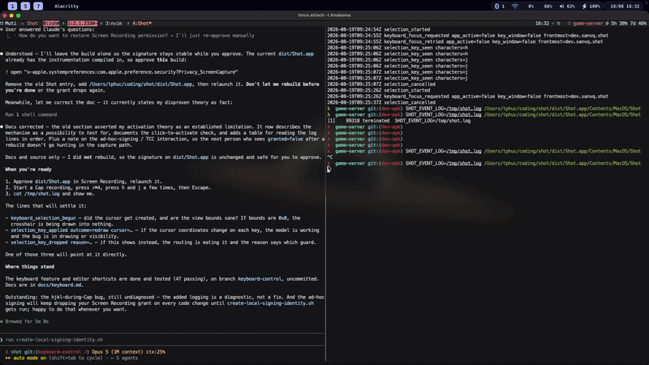

# Keyboard control

Shot can be driven without the mouse in two places: choosing the capture area,
and drawing on the capture afterwards. Both share one motion keymap, so `hjkl`
means the same thing in either.



Press `?` in either place to see the keys without leaving the app. The editor
also has a `?` button in its toolbar.

## Turning it on

Editor keys are always on.

Keyboard selection is off by default, because it adds a cursor and a hint strip
to the capture overlay. Turn it on from **Keyboard Selection** in the menu bar,
or:

```sh
defaults write dev.sanvq.shot keyboardSelection -bool true
```

With it off, the capture overlay behaves exactly as it did before the feature
existed.

## Motion

Shared by both contexts.

| Keys | Action |
| --- | --- |
| `h` `j` `k` `l`, arrows | Move 20 pt |
| `H` `J` `K` `L`, shift–arrows | Move 1 pt, for pixel precision |
| `0` `$` | Left, right edge |
| `gg` `G` `M` | Top, bottom, vertical middle |
| `v`, space | Set or drop the anchor |
| `o` | Swap the anchor and the cursor |

Both step sizes are constants — `SelectionKey.step` and
`SelectionKey.preciseStep`. Hold a motion key to cover ground, or use a jump to
get near before nudging.

Unlike vim, `H` and `L` move horizontally rather than to the top and bottom of
the screen; `gg`, `G`, and `M` cover those.

## Choosing the capture area

Applies to area capture (⇧⌘4), pin (⇧⌘2), and text capture (⇧⌘1). Fullscreen
capture (⇧⌘3) takes no selection.

The cursor starts on the display under the pointer and stays there. Other
displays keep their dimmed overlay but get no cursor. The mouse keeps working
throughout — click to take the cursor back, and the keyboard picks up from
wherever you clicked.

| Keys | Action |
| --- | --- |
| Motion above | Move the cursor |
| `10j`, `300l` | Repeat the next motion |
| `a` | Anchor the whole screen |
| Return, `y` | Capture |
| `?` | Show or hide the shortcut list |
| Escape, `q` | Cancel |

A badge by the cursor shows its position, then the selection size once
anchored. The pointer hides on the first key press and comes back when you move
the mouse.

## Drawing in the editor

| Keys | Action |
| --- | --- |
| `P` `R` `A` `T` | Pencil, Rectangle, Arrow, Text |
| `1`–`6` | Red, Yellow, Green, Blue, Black, White |
| `[` `]` | Thinner or thicker line, smaller or larger text |
| Motion above | Move the cursor on the image |
| Return, `y` | Commit the shape |
| `S`, Command–`S` | Save to `~/Documents/screenshot` |
| Command–`C` | Copy and keep editing |
| Command–`Z`, Command–Shift–`Z` | Undo, redo |
| `?` | Show or hide the shortcut list |
| Escape | Cancel the shape in progress, otherwise copy and close |

Press a motion key to bring up a cursor on the image, `v` to anchor one end,
motion again to stretch, and Return to commit. Colors and `[` `]` still work
mid-shape, so a rectangle can be restyled before it is committed. `q` also
cancels an uncommitted shape.

Pencil commits a straight segment between the two points; freehand needs the
mouse. With the text tool, `v` opens the text box at the cursor instead of
anchoring, and Escape commits it as usual.

Escape is layered, and each step only fires when the one before it had nothing
to do: dismiss the help panel, cancel the shape, end text editing, copy and
close.

### Where the editor differs

| | Capture overlay | Editor |
| --- | --- | --- |
| `a` | Anchor the whole screen | Arrow tool |
| `1`–`6` | Count prefix digits | Colors |
| `7`–`9` | Count prefix digits | Unbound |
| Count prefixes | `10j`, `300l` | Not available |

`0` still jumps to the left edge in both.

## Diagnostics

The capture overlay reads keys through a local event monitor, which only sees
events macOS dispatches to Shot. That requires Shot to be the active app, so
anything that costs Shot activation also costs it the keyboard. Clicking
anywhere on the overlay activates Shot and drops the cursor at the click, which
is a useful check: if the keys start working after a click, activation was the
problem.

Reading keys regardless of activation would need a `CGEventTap` and the
Accessibility permission, which Shot deliberately does not ask for.

To trace a key that goes missing, point the event log at a file and reproduce:

```sh
defaults write dev.sanvq.shot eventLogPath /tmp/shot.log
```

Then relaunch Shot normally. Prefer this over the `SHOT_EVENT_LOG` environment
variable, which only arrives when Shot is launched from a shell — and launching
the bundle's binary directly skips the usual activation handshake, so
`app_active` reads false in a way that says nothing about a normal launch.

The lines to read, in order:

| Line | Means |
| --- | --- |
| `keyboard_focus_requested`, `keyboard_focus_retried` | Whether Shot won activation and the overlay became key |
| `keyboard_selection_begun` | The cursor exists, with its starting position and the view bounds |
| `selection_key_seen` | The monitor received the key, so it reached Shot |
| `selection_key_dropped` | The key reached Shot and was discarded, with the reason |
| `selection_key_applied` | The model accepted it, with the resulting cursor and anchor |

No `selection_key_seen` line means the event never reached Shot at all, which
is an activation problem. A `selection_key_seen` with no `selection_key_applied`
means it reached Shot and died in the routing.

### Rebuilding drops the Screen Recording permission

If `screen_capture_permission granted=false` appears after a rebuild, the cause
is signing rather than anything in the capture path. Without `.signing/`,
`build-app.sh` falls back to an ad-hoc signature, so every binary change
produces a new code directory hash, macOS treats it as a different app, and the
grant is dropped. Run `scripts/create-local-signing-identity.sh` once to get a
stable local identity that survives rebuilds.

## How it works

| File | Role |
| --- | --- |
| `KeyboardSelection.swift` | `SelectionKey.resolve` maps a key press to an intent; `KeyboardSelection` is a pure cursor-and-anchor model. No views. |
| `KeyboardChrome.swift` | Crosshair, badge, and help-panel drawing, shared by both contexts. |
| `SelectionOverlay.swift` | Routes keys from the overlay's event monitor into the model and draws the result. |
| `PreviewWindowController.swift` | The same for the editor canvas, plus turning a committed anchor and cursor into an `AnnotationShape`. |
| `AnnotationEditor.swift` | `EditorShortcut.resolve` for the editor's own keys, and `AnnotationTool.shape(from:to:)` for the tool-to-shape mapping. |

### Key routing

The capture overlay already ran a local `keyDown` monitor for Escape, so the
vim keys go through that same monitor. No new event plumbing, and no dependence
on which window is key.

The editor resolves in a fixed order, first match wins:

1. Escape, handled directly by `EditorPanel`.
2. `EditorShortcut.resolve` — tools, colors, style, save, copy, undo, redo, `?`.
3. `SelectionKey.resolve` — whatever is left, which is the motion set.
4. `super.keyDown`, so genuinely unbound keys still beep.

That order is why the editor has no count prefixes: `1`–`6` are claimed as
colors in step 2 and never reach step 3. Keys the drawing layer declines are
returned as unhandled rather than swallowed, so they fall through to step 4
instead of silently doing nothing.

### Coordinate spaces

`SelectionView` is unflipped. `AnnotationCanvasView` overrides `isFlipped` to
true and works in image coordinates. `KeyboardSelection` therefore takes an
`isFlipped` flag: motion keys and the top and bottom jumps are named for what
the user sees, so they invert when it is set.

Keep that flip inside the model. An earlier version transformed each key at the
call site instead, which could not reach `gg` — that pair is resolved from
state inside `apply(_:)`, so it bypassed the transform and sent `gg` to the
bottom of the image rather than the top.

### Adding a key

1. Add a case to `SelectionKey` or `EditorShortcut` and map it in `resolve`.
2. Handle it in `KeyboardSelection.apply` if it moves the cursor or anchor, or
   in the view if it is presentation only, as `?` is.
3. Add a row to the matching `helpRows` so `?` stays accurate.
4. Cover `resolve` and any model behaviour in the tests. The whole layer is
   unit-testable without a window and should stay that way.
